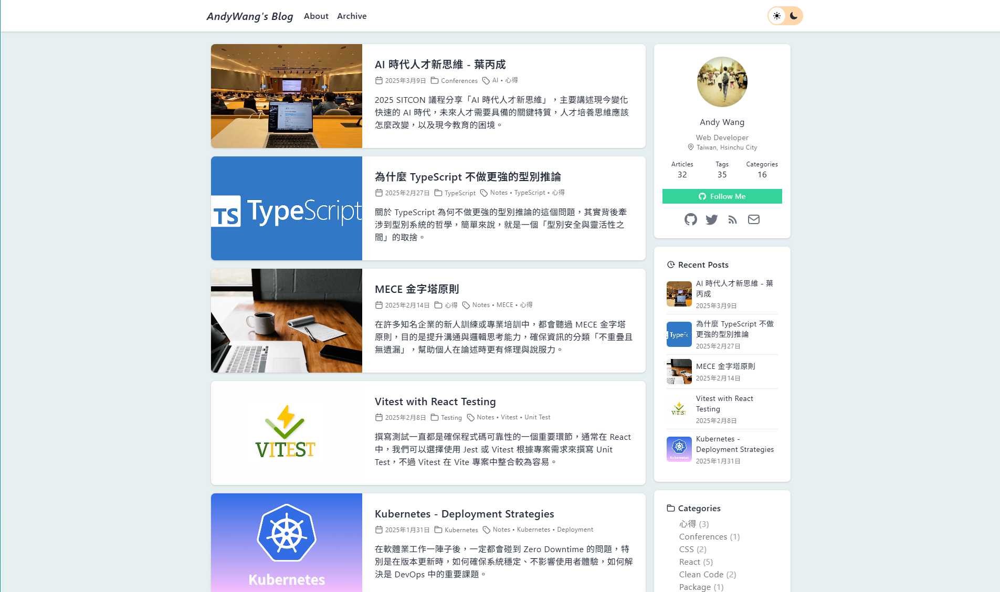
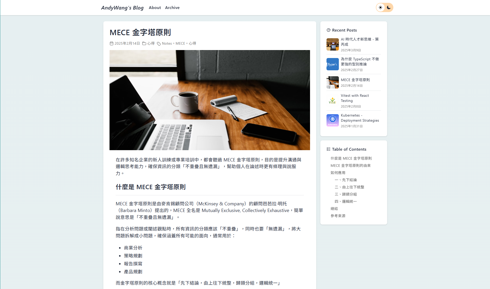
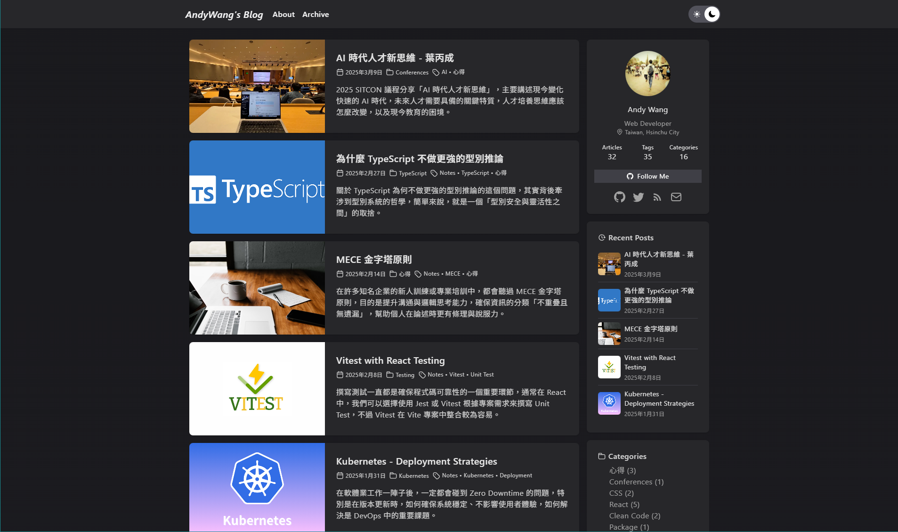
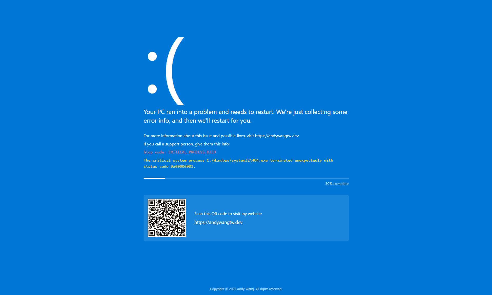

# Andy Wang's Blog

My personal blog built with Astro, sharing thoughts and experiences.

## Features

- Modern and responsive design
- Dark mode support
- Category and tag system
- Markdown support

## Tech Stack

- Astro
- React
- Tailwind CSS
- TypeScript

## Screenshots

<table>
  <tr>
    <td></td>
    <td></td>
  </tr>
  <tr>
    <td></td>
    <td></td>
  </tr>
</table>

## License

This project is licensed under the MIT License - see the [LICENSE](LICENSE) file for details.

Copyright (c) 2024 AndyWang
